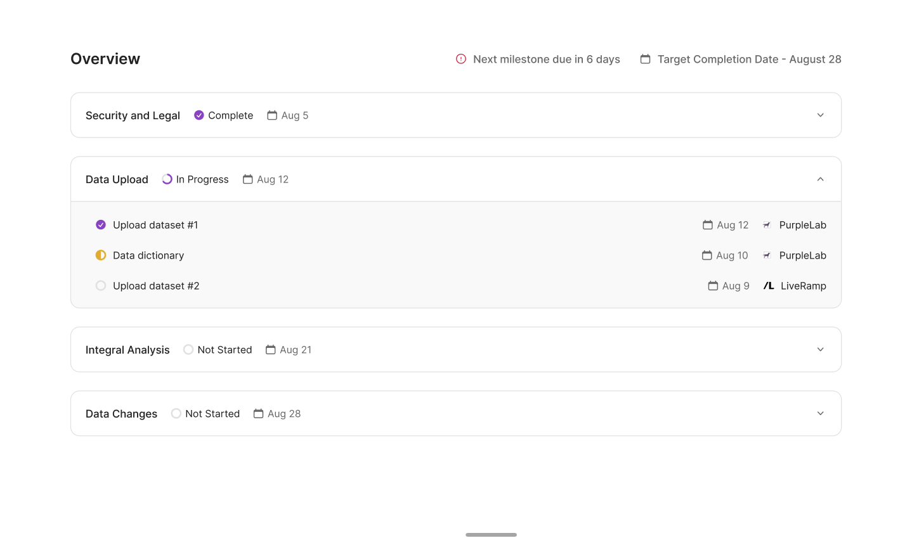

# Integral Take-Home Challenge

Welcome to Integral's Take-Home Challenge! Should you choose to accept this challenge, you will be tasked with transforming our currently static tasks page into a dynamic one. The page displays a list of tasks, each falling under different milestones. In the certification workflow, there's a measure of pre-work necessary before Integral gains access to sensitive data for certification. Our goal is to provide our customers with visibility into this entire process.

## Setup

1. Clone the repository to your local machine.
2. Run `npm i` to install all necessary dependencies.
3. Run `npm run dev` to start the development server.
4. In a separate terminal, run `npm run server` to start the JSON server.
5. Visit `http://localhost:3000/` in the browser to see the running app.

## The Challenge

Your task is to make the tasks page more dynamic and visually align it with a provided design (please refer to `design.png` in the project root directory).

Here's the initial database schema for your reference, stored in the `db.json` file:

```json
{
    "milestones": [
      {
        "id": 1,
        "name": "Security and Legal",
        "status": "COMPLETE"
      },
      ...
    ],
    "tasks": [
      {
        "id": 1,
        "title": "Upload dataset #1",
        "milestone_id": 2,
        "status": "COMPLETE"
      },
      ...
    ]
}
```

This project uses json-server to mimic a REST API. It allows us to focus on the front-end part of the challenge without needing to set up a proper database with a schema and migrations.

## Design Reference


## Goals
- Match the given design as much as possible
- Fetch the milestones and tasks data from the json-server and display them on the page dynamically.
- Group the tasks under their respective milestones.
- Tasks and milestones should reflect their respective statuses.

## Bonus points ideas
- Implement functionality to add, edit, and delete tasks and milestones.
- Mobile display responsiveness

## Time Allocation
This challenge is designed to be completed in about 90 minutes. We're not just looking for completion of the task - how you approach the problem and the decisions you make will also be considered.

## Starting Point
Start by editing the file `src/app/page.tsx`.

## Submission
Once you've completed the challenge, please commit your changes, push them to your own GitHub repository, and share the link with us. Alternatively emailing a zip file of the repository to john@useintegral.com is acceptable.

We wish you the best of luck and are looking forward to reviewing your solution!


## Frequently Asked Questions (FAQs)

**Q: Can I update the `db.json` file?**

A: Absolutely! You're welcome to modify the schema in the `db.json` file to better suit your approach to the challenge. Keeping the schema as is would also be perfectly acceptable.

**Q: Can I integrate Bootstrap or Tailwind CSS frameworks?**

A: Yes, you are free to integrate either Bootstrap or Tailwind. However, keep in mind that the time taken to set these up may consume a chunk of the 90-minute timeframe. This challenge focuses more on your approach and decision-making rather than delivering a perfect solution.
